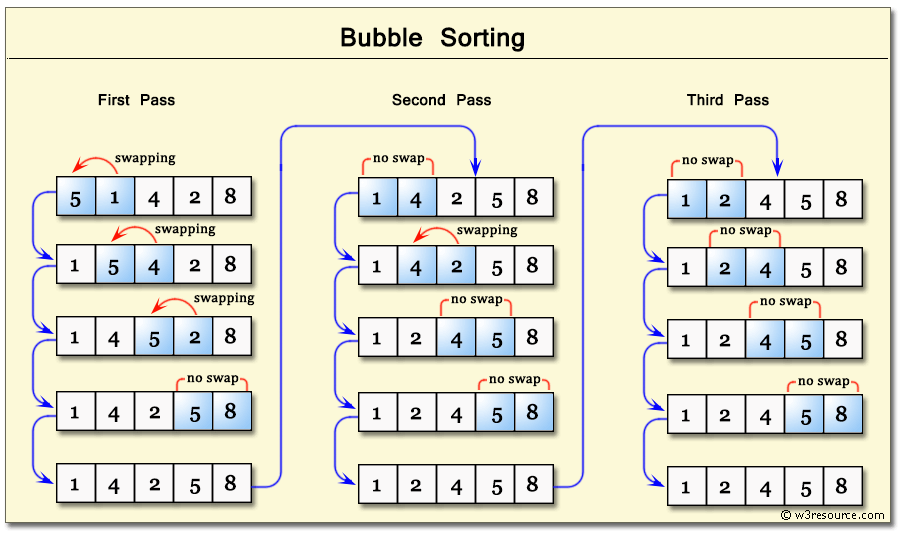
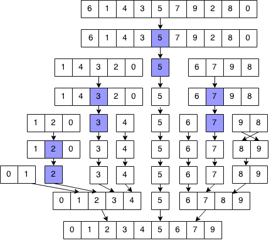

# Algoritmos de Ordenamiento (Sorting algorithms)

1. ## **Bubble Sort:**

   - _Características Principales:_
     - Es uno de los algoritmos más sencillos.
     - Itera sobre la lista varias veces, comparando elementos adyacentes y realizando intercambios si es necesario.
     - Tiene una complejidad de tiempo cuadrática O(n^2) en el peor caso.
     - No es eficiente para listas grandes.

    - _Funcionamiento del Algoritmo:_
        - Comparación de Elementos Adyacentes: Comienza comparando el primer elemento con el segundo, luego el segundo con el tercero, y así sucesivamente. Compara elementos adyacentes de la lista.
        - Intercambio si es Necesario: Si el elemento actual es mayor que el siguiente (en el caso de orden ascendente), se intercambian. Este proceso se repite para cada par de elementos adyacentes en la lista.
        - Una Pasada Completa: Una vez completada la primera pasada, el elemento más grande estará en la última posición de la lista no ordenada. En cada pasada, el siguiente elemento más grande se coloca en su posición correcta.
        - Iteración Hasta la Ordenación Completa: El proceso se repite para todas las pasadas necesarias hasta que toda la lista esté ordenada. En cada pasada, el algoritmo compara y coloca el elemento más grande de la parte no ordenada en su posición correcta.
        - Optimización: Una optimización común es detener el algoritmo si en una pasada completa no se realiza ningún intercambio. Esto significa que la lista ya está ordenada, y no es necesario continuar con más pasadas.
        
    - _Complejidad_

        La complejidad de tiempo en el peor caso de Bubble Sort es O(n^2), donde "n" es la longitud de la lista. Esto lo hace ineficiente para listas grandes, y generalmente se prefiere para propósitos educativos.
    

    
    

2. ## **Heap Sort:**

   - _Características Principales:_
     - Utiliza una estructura de datos llamada heap (montículo) para organizar los elementos.
     - Es más eficiente que Bubble Sort y tiene una complejidad de tiempo O(n log n).
     - No requiere memoria adicional ya que trabaja directamente sobre la lista existente.
     - Es inestable, lo que significa que no preserva el orden relativo de elementos iguales.
    - _Funcionamiento del Algoritmo:_
        - Fase de Max-Heapify:
            Comienza construyendo un max-heap a partir de la lista no ordenada. Un max-heap es un tipo de heap en el que el valor de cada nodo es mayor o igual que los valores de sus nodos hijos.
            Se recorre la lista desde la mitad hacia atrás (hacia el inicio) y se realiza la operación de "max-heapify" en cada elemento. Esto ajusta la posición del elemento en el heap para garantizar que se cumpla la propiedad de max-heap
        - Extracción de Elementos:
            Después de construir el max-heap, el elemento más grande (raíz del heap) se encuentra en la posición 0. Se intercambia con el último elemento de la lista no ordenada.
            Luego, se reduce el tamaño del heap (ignorando el último elemento que ahora está ordenado) y se realiza la operación de max-heapify en la raíz para restaurar la propiedad de max-heap.
            Este proceso se repite hasta que todos los elementos estén en la lista ordenada
    - _Complejidad_

        La complejidad de tiempo de Heap Sort es O(n log n) en el peor caso. La fase de construcción del heap tiene una complejidad de tiempo O(n), y el proceso de extracción de elementos se repite n veces, cada vez con una complejidad logarítmica debido a las operaciones de max-heapify. Esto hace que Heap Sort sea eficiente para listas grandes.

    

    
    

3. ## **Insertion Sort:**

   - _Características Principales:_
     - Es eficiente para listas pequeñas o parcialmente ordenadas.
     - Construye la lista ordenada uno a uno, insertando elementos en su posición correcta.
     - Tiene una complejidad de tiempo O(n^2) en el peor caso.
     - Puede ser más eficiente que otros algoritmos para listas pequeñas debido a su baja sobrecarga.
    - _Funcionamiento del Algoritmo_
        - Inicio y Lista No Ordenada:
        Inicialmente, se asume que el primer elemento de la lista es una lista ordenada de un solo elemento. El resto de la lista se considera no ordenada.
        - Iteración sobre la Lista No Ordenada:
        Comienza iterando sobre la lista no ordenada, tomando cada elemento uno por uno.
        - Comparación e Inserción:
        Compara el elemento actual con los elementos en la lista ordenada. Se mueven hacia la derecha en la lista ordenada hasta encontrar la posición correcta para el elemento actual.
        Durante esta comparación, los elementos mayores se desplazan a la derecha para hacer espacio para el nuevo elemento.
        - Repetición:
        Este proceso se repite hasta que todos los elementos de la lista no ordenada se han insertado en la lista ordenada.
    - _Complejidad_

        La complejidad de tiempo de Insertion Sort es O(n^2) en el peor caso, donde "n" es el tamaño de la lista. Es eficiente para listas pequeñas o parcialmente ordenadas, pero puede volverse ineficiente para listas grandes. Sin embargo, su complejidad en el mejor caso es O(n), lo que lo hace eficiente para listas casi ordenadas.

    

    
    

    

4. ## **Selection Sort:**

   - _Características Principales:_
     - Encuentra el elemento mínimo en cada iteración y lo intercambia con el primer elemento no ordenado.
     - Es simple pero ineficiente para listas grandes.
     - Tiene una complejidad de tiempo O(n^2) en el peor caso.
     - No es estable.
    - _Funcionamiento del Algoritmo_
        - Inicio con lista No Ordenada: Inicialmente, la lista ordenada está vacía y la lista no ordenada contiene todos los elementos.
        - Selección del Elemento Más Pequeño: Itera sobre la lista no ordenada para encontrar el elemento más pequeño. Intercambia este elemento con el primer elemento de la lista no ordenada.
        - Ampliación de la Lista Ordenada: El elemento más pequeño se considera parte de la lista ordenada y se excluye de la lista no ordenada. La lista ordenada se incrementa en uno y la lista no ordenada se reduce en uno.
        - Repetición:
        Este proceso se repite hasta que no quedan elementos en la lista no ordenada
    - _Complejidad_

        La complejidad de tiempo de Selection Sort es O(n^2) en el peor caso, donde "n" es la longitud de la lista. Es ineficiente para listas grandes, pero su implementación simple puede ser útil en situaciones con recursos limitados o para listas pequeñas. 
        También es inestable ya que no preserva el orden relativo de elementos iguales

    

    
    

    

5. ## **Shell Sort:**
    También conocido como el método de ordenación por incrementos decrecientes, es una variante mejorada del algoritmo de inserción.
   - _Características Principales:_
     - Mejora el rendimiento de Insertion Sort al comparar y intercambiar elementos a intervalos más grandes.
     - Utiliza una secuencia de brechas para determinar los intervalos.
     - Tiene una complejidad de tiempo que depende de la secuencia de brechas utilizada, pero en el peor caso es O(n log n).

    - _Funcionamiento del Algoritmo_
        - Elección de la Secuencia de Espaciados(Brechas): Se elige una secuencia de brechas que determina los intervalos en los que se aplicarán las operaciones de inserción. Las brechas se eligen típicamente de manera que comiencen con un intervalo grande y se reduzcan gradualmente hasta llegar a 1.
        - Iteración con Espaciados(Brechas): Se realizan pasadas sobre la lista para cada brecha seleccionada. En cada pasada, los elementos separados por la brecha son comparados e intercambiados si es necesario.
        - Reducción de Espaciados(Brechas): Después de completar una pasada con una brecha particular, la brecha se reduce y se repite el proceso hasta que la brecha alcanza el valor de 1.
        - Pasada Final: La última pasada se realiza con una brecha de 1, lo que equivale a una operación de inserción estándar. La lista debería estar bastante ordenada en este punto debido a las pasadas previas con brechas más grandes.
    - _Complejidad_

        La complejidad de tiempo de Shell Sort depende de la secuencia de brechas seleccionada. La elección de una buena secuencia puede resultar en un rendimiento bastante eficiente. En el peor caso, la complejidad de tiempo es O(n^2), pero en muchos casos prácticos, Shell Sort supera a otros algoritmos cuadráticos, como Insertion Sort y Selection Sort.
    
    

    
    

6. ## **Merge Sort:**

   - _Características Principales_

     - Utiliza el enfoque de dividir y conquistar.
     - Divide la lista en mitades, ordena cada mitad y luego fusiona las mitades ordenadas.
     - Es eficiente y tiene una complejidad de tiempo O(n log n) en todos los casos.
     - Requiere memoria adicional para almacenar las mitades temporales.

    - _Funcionamiento del Algoritmo_

        - División:
        La lista no ordenada se divide en mitades sucesivas hasta que cada sublista tenga un solo elemento. Esto se hace recursivamente, dividiendo repetidamente cada sublista hasta que cada una contiene un solo elemento.
        - Ordenación Recursiva:
        Se ordenan las sublistas de manera recursiva utilizando el mismo enfoque de dividir y conquistar. Cada par de sublistas ordenadas se fusiona para formar una sublista ordenada más grande.
        - Fusión(Merge):
        Las sublistas ordenadas se fusionan para formar sublistas más grandes y, finalmente, la lista completa ordenada. En cada paso de fusión, los elementos se comparan y colocan en orden en una lista auxiliar.

    - _Ventajas_

        - Merge Sort es estable y eficiente para listas grandes y en situaciones en las que los datos están distribuidos en forma desordenada.
        - Tiene una complejidad de tiempo garantizada de O(n log n) en todos los casos.
    - _Desventajas_

        - Requiere memoria adicional para almacenar las sublistas temporales durante la fase de fusión.
        - En situaciones en las que el espacio de memoria es crítico, esto puede ser una desventaja.

    - _Complejidad_

        La complejidad de tiempo de Merge Sort es O(n log n) en todos los casos. La fase de fusión contribuye con la mayor parte de la complejidad, y la recursión asegura que cada elemento sea tratado logarítmicamente muchas veces.

    

    
    

    

7. ## **Quick Sort:**
   - _Características Principales_

     - También utiliza el enfoque de dividir y conquistar.
     - Elige un elemento pivote, coloca los elementos menores a la izquierda y los mayores a la derecha.
     - Recursivamente ordena las dos sub-listas.
     - Tiene una complejidad de tiempo O(n log n) en el promedio, pero puede degradarse a O(n^2) en el peor caso (siempre que se elija un pivote desfavorable).

    - _Funcionamiento del Algoritmo_

        - Elección del Pivote:
            Se elige un elemento de la lista como pivote. La elección del pivote puede afectar el rendimiento del algoritmo. Las estrategias comunes incluyen elegir el primer, último o elemento central.
        - Partición:
            Los elementos se reorganizan de manera que los elementos menores que el pivote estén a su izquierda y los elementos mayores estén a su derecha. En este punto, el pivote está en su posición final.
        - Recursión:
            Se aplica el mismo proceso de manera recursiva a las sublistas a la izquierda y a la derecha del pivote hasta que toda la lista esté ordenada.

    - _Ventajas_

        - Quick Sort es eficiente en la práctica y es uno de los algoritmos de ordenación más rápidos en la mayoría de los casos.
        - Puede ser más rápido que algoritmos como Merge Sort debido a su menor necesidad de memoria adicional.
    - _Desventajas_

        - En el peor caso, la complejidad de tiempo puede degradarse a O(n^2), aunque esto es poco común en situaciones prácticas.
        - No es estable por defecto, ya que no preserva el orden relativo de elementos iguales.
    - _Complejidad_

        La elección eficiente del pivote permite que Quick Sort tenga una complejidad de tiempo promedio de O(n log n). Sin embargo, en el peor caso (siempre que se elija un pivote desfavorable), la complejidad puede ser O(n^2).

    

    
    
